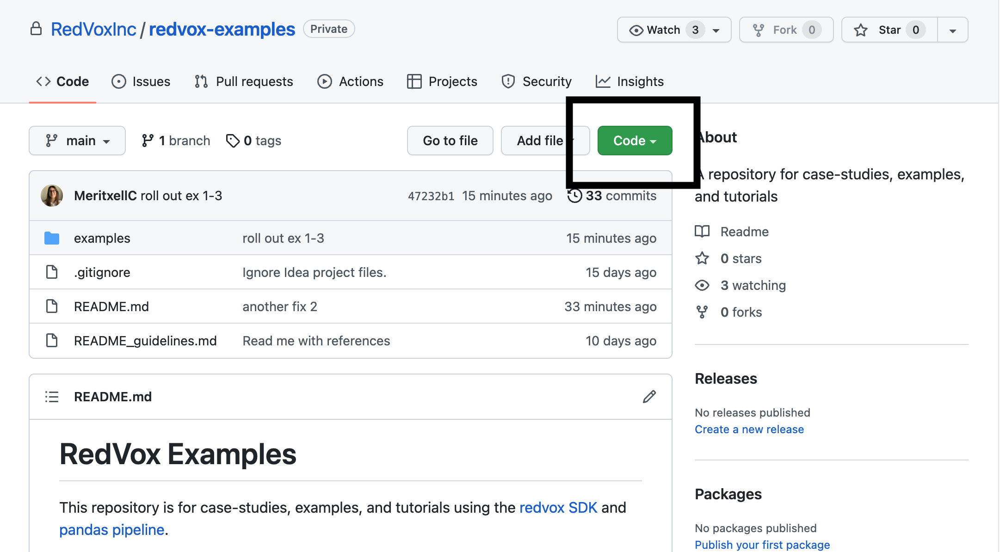
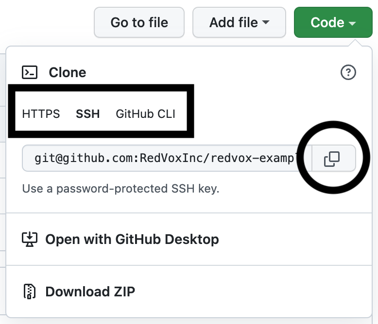
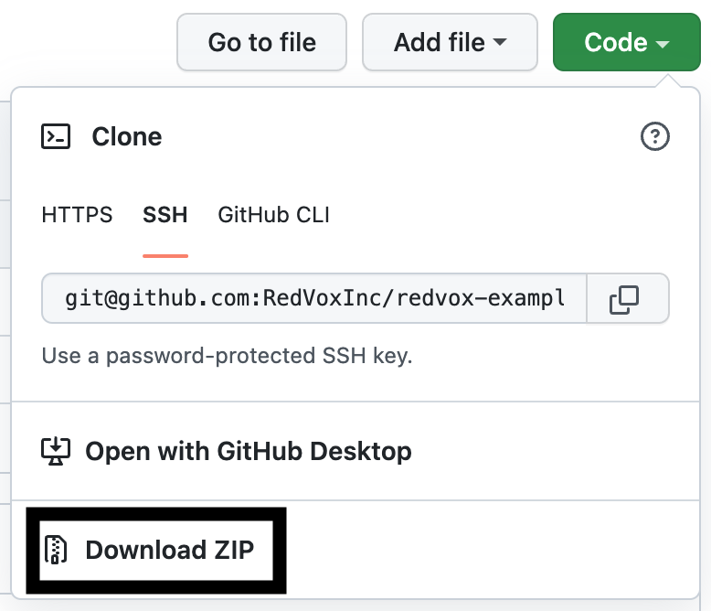

# RedVox Examples

This repository is for case-studies, examples, and tutorials using the [redvox SDK](https://github.com/RedVoxInc/redvox-python-sdk)
and [pandas pipeline](https://github.com/RedVoxInc/redpandas).

Check out the [documentation](https://github.com/RedVoxInc/redvox-examples)

We recommend you start with the [first example (ex_00 report_audio)](https://github.com/RedVoxInc/redvox-examples/tree/main/examples/ex_00_report_audio),
which loads audio data from a [Redvox report downloaded from redvox.io](https://redvox.io/#/reports/E328).

### Getting started
How to get the examples onto your computer:

- If you have access to Git, you can clone the entire examples repository
  1. Find the green code button above this readme.  It will be on the right.  Click on it to view more options.  
    Refer to the screenshot below.  

  2. Choose the connection type to clone with, then click on the button to the right of the textbox to copy 
    the string to your clipboard.  Refer to the screenshot below.  

  3. Input the copied string into your preferred method of using Git.  The repository will be copied onto 
    your machine for you to edit.
  
  Please note:
   - Refer to the [Github help docs on cloning a repository](https://docs.github.com/en/repositories/creating-and-managing-repositories/cloning-a-repository)
     as needed.
   - If using the SSH option, you need an SSH key associated with Github.  Refer to the
     [Github help docs on uploading an SSH key](https://docs.github.com/en/authentication/connecting-to-github-with-ssh/adding-a-new-ssh-key-to-your-github-account)
     as needed.

- If you don't have access to Git, you may download a zipped version of this repository.
  1. Find the green code button above this readme.  Click on it to view more options.
  2. Choose the bottom option to download the repository as a .zip file.  Refer to the screenshot below. 
     

  3. Find the downloaded file and unzip it to your working directory using your preferred method.

### Examples
Examples focused on using the RedVox SDK:

0. [Loading the Audio data from a RedVox Report](https://github.com/RedVoxInc/redvox-examples/tree/main/examples/ex_00_report_audio)
1. [Loading the Accelerometer data from a RedVox Report](https://github.com/RedVoxInc/redvox-examples/tree/main/examples/ex_01_report_accelerometer#example-01-accelerometer-waveforms-from-redvox-report-datawindow)
2. [Loading other sensors from a RedVox Report](https://github.com/RedVoxInc/redvox-examples/tree/main/examples/ex_02_other_sensors#example-02-other-sensors-in-the-redvox-report-datawindow)
3. [Loading Metadata and State of Health data from a RedVox Report](https://github.com/RedVoxInc/redvox-examples/tree/main/examples/ex_03_metadata_and_soh#example-03-accessing-station-metadata-and-state-of-health)

Examples focused on using RedPandas:

4. [Plotting wiggles from Audio data](https://github.com/RedVoxInc/redvox-examples/tree/main/examples/ex_04_plot_wiggles_audio#example-04-plot-audio-wiggles)
5. [Plotting spectrograms from Audio data](https://github.com/RedVoxInc/redvox-examples/tree/main/examples/ex_05_plot_spectrogram_audio#example-05-plot-audio-spectrogram)

Example using the [redvox.io](https://redvox.io) website to view Machine Learning products:

6. [Getting YAMNet classifications from a RedVox Report](https://github.com/RedVoxInc/redvox-examples/tree/main/examples/ex_06_cloud_yamnet/cloud_yamnet.md)
7. [Using the YAMNet CSV from a RedVox Report](https://github.com/RedVoxInc/redvox-examples/tree/main/examples/ex_07_yamnet_csv#example-07-yamnet-csv-from-redvox-report)

### Contributors
If you would like to contribute to this repository, please refer to the
[guidelines](https://github.com/RedVoxInc/redvox-examples/blob/main/README_guidelines.md).

## References

RedVox Application Programming Interface (API). Available online: https://github.com/RedVoxInc/redvox-api-1000

RedVox Software Developer Kit (SDK). Available online: https://github.com/RedVoxInc/redvox-python-sdk

Redvox-Pandas pipeline (RedPandas). Available online: https://github.com/RedVoxInc/redpandas

RedVox and RedPandas published example _Skyfall_:

Garcés, M. A., D. Bowman, C. Zeiler, A. Christe, T. Yoshiyama,
B. Williams, M. Colet, S. Takazawa, S. Popenhagen. Skyfall: Signal Fusion from a Smartphone Falling from the Stratosphere,
Signals Special Issue: Internet of Things for Smart Planet: Present and Future, 2022,
3(2), 209-234; https://doi.org/10.3390/signals3020014

Github repository showcasing _Skyfall_ example: https://github.com/RedVoxInc/Skyfall