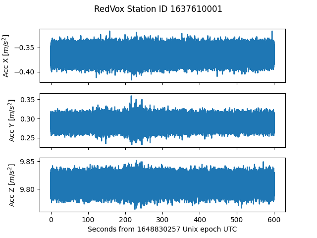

# Load the Accelerometer data 

In the [previous example](00_audio_from_report.md), we loaded single-channel data (Audio). The next step is to load 
three-channel data such as the Accelerometer (X, Y and Z dimensions) following a similar process as the 
[Audio](00_audio_from_report.md) data. 

## Running the example
The first step is to load [RedVox data](getting_data_from_report.md) in a
[DataWindow](https://github.com/RedVoxInc/redvox-python-sdk/tree/master/docs/python_sdk/data_window#-redvox-python-sdk-datawindow-manual).

```python
from redvox.common.data_window import DataWindow

# Input Directory
input_dir = "path/to/redvox/data/dw_1648830257000498_2.pkl.lz4"

# Load data window from report
dw = DataWindow.deserialize(input_dir)
```
Next, extract the Accelerometer data for each Station stored in the DataWindow.

```python
from redvox.common.data_window import DataWindow

# Input Directory
input_dir = "path/to/redvox/data/dw_1648830257000498_2.pkl.lz4"

# Load data window from report
dw = DataWindow.deserialize(input_dir)

# Loop to extract Accelerometer data from all stations
for station in dw.stations():
    # Check that there is accelerometer data in the first place
    if station.has_accelerometer_data():
        # Accelerometer has 3 channels - x, y and z
        accelerometer_x_samples = station.accelerometer_sensor().get_accelerometer_x_data()
        accelerometer_y_samples = station.accelerometer_sensor().get_accelerometer_y_data()
        accelerometer_z_samples = station.accelerometer_sensor().get_accelerometer_z_data()
        # The channels share the same timestamps - format to seconds
        accelerometer_time_micros = station.accelerometer_sensor().data_timestamps() - station.accelerometer_sensor().first_data_timestamp()
        accelerometer_time_s = accelerometer_time_micros*1E-6
```
We can plot the Accelerometer data using the [Matplotlib](https://matplotlib.org/) library to visualize it.

```python
from redvox.common.data_window import DataWindow
import matplotlib.pyplot as plt

# Input Directory
input_dir = "path/to/redvox/data/dw_1648830257000498_2.pkl.lz4"

# Load data window from report
dw = DataWindow.deserialize(input_dir)

for station in dw.stations():
    # Check that there is accelerometer data in the first place
    if station.has_accelerometer_data():
        # Accelerometer has 3 channels - x, y and z
        accelerometer_x_samples = station.accelerometer_sensor().get_accelerometer_x_data()
        accelerometer_y_samples = station.accelerometer_sensor().get_accelerometer_y_data()
        accelerometer_z_samples = station.accelerometer_sensor().get_accelerometer_z_data()
        # The channels share the same timestamps - format to seconds
        accelerometer_time_micros = station.accelerometer_sensor().data_timestamps() - station.accelerometer_sensor().first_data_timestamp()
        accelerometer_time_s = accelerometer_time_micros*1E-6

        # Plot the acceleration data - one subplot per channel
        fig, ax = plt.subplots(nrows=3, ncols=1, sharex='col')
        ax[0].plot(accelerometer_time_s, accelerometer_x_samples)
        ax[1].plot(accelerometer_time_s, accelerometer_y_samples)
        ax[2].plot(accelerometer_time_s, accelerometer_z_samples)
    
        # Set labels and subplot title
        ax[0].set_ylabel('Acc X [m/s]')
        ax[1].set_ylabel('Acc Y [m/s]')
        ax[2].set_ylabel('Acc Z [m/s]')
        ax[2].set_xlabel(f"Seconds from {int(dw.start_date()*1E-6)} Unix epoch UTC")
    
        plt.suptitle(f"RedVox Station ID {station.id()}")

plt.show()
```
## Example output

After running the above code snippet, the following graph should appear:



For a more complete example on how to load the other sensor data, visit 
[Github](https://github.com/RedVoxInc/redvox-examples/blob/main/examples/ex_01_report_accelerometer/load_accelerometer.py).

In the next section, we will take a look at loading [other sensors](02_other_sensors_from_report.md) such as the barometer 
and the magnetometer.