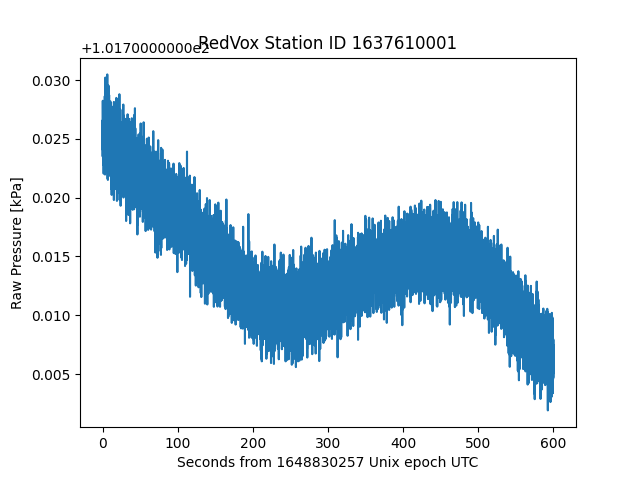

# Load Other Sensor Data

The [DataWindow](https://github.com/RedVoxInc/redvox-python-sdk/tree/master/docs/python_sdk/data_window#-redvox-python-sdk-datawindow-manual) 
contains single-channel sensors, such as [audio](00_audio_from_report.md), and three-channel sensors, 
such as [accelerometer](01_accelerometer_from_report.md). In this example we will take a look at the general procedure
to obtain single-channel sensor data (barometer in this example), and three-channel sensor data, (magnetometer in this example).

For more Sensors available in the DataWindow, check out the
[Sensor documentation](https://github.com/RedVoxInc/redvox-python-sdk/tree/master/docs/python_sdk/data_window/station#sensor-data-access).

## Running the example
The first step is to load [RedVox data](getting_data_from_report.md) in a
[DataWindow](https://github.com/RedVoxInc/redvox-python-sdk/tree/master/docs/python_sdk/data_window#-redvox-python-sdk-datawindow-manual).

```python
from redvox.common.data_window import DataWindow

# Input Directory
input_dir = "path/to/redvox/data/dw_1648830257000498_2.pkl.lz4"

# Load data window from report
dw = DataWindow.deserialize(input_dir)
```

Single-channel sensors such as the barometer sensor load the same way as the [audio](00_audio_from_report.md) sensor.

```python
from redvox.common.data_window import DataWindow
import matplotlib.pyplot as plt

# Input Directory
input_dir = "path/to/redvox/data/dw_1648830257000498_2.pkl.lz4"

# Load data window from report
dw = DataWindow.deserialize(input_dir)

for station in dw.stations():
    # Single channel sensors such as barometer load the same way as audio
    # Check that there is barometer data in the first place
    if station.has_barometer_data():

        # Get barometer data and timestamps (format to seconds) 
        barometer_samples = station.barometer_sensor().get_pressure_data()
        barometer_time_micros = station.barometer_sensor().data_timestamps() - \
                                station.barometer_sensor().first_data_timestamp()
        barometer_time_s = barometer_time_micros*1E-6
    
        # Plot the barometer data
        plt.figure()
        plt.plot(barometer_time_s, barometer_samples)
        plt.title(f"RedVox Station ID {station.id()}")
        plt.xlabel(f"Seconds from {int(dw.start_date()*1E-6)} Unix epoch UTC")
        plt.ylabel("Barometer Pressure [kPa]")

plt.show()
```

Three-channel sensors such as the magnetometer sensor load the same as the [accelerometer](02_other_sensors_from_report.md) sensor.

```python
from redvox.common.data_window import DataWindow
import matplotlib.pyplot as plt

# Input Directory
input_dir = "path/to/redvox/data/dw_1648830257000498_2.pkl.lz4"

# Load data window from report
dw = DataWindow.deserialize(input_dir)

for station in dw.stations():    
    # Multi-channel sensors such as magnetometer load the same as the accelerometer sensor
    # Check that there is magnetometer data in the first place
    if station.has_magnetometer_data():

        # Magnetometer has 3 channels - x, y and z
        magnetometer_x_samples = station.magnetometer_sensor().get_magnetometer_x_data()
        magnetometer_y_samples = station.magnetometer_sensor().get_magnetometer_y_data()
        magnetometer_z_samples = station.magnetometer_sensor().get_magnetometer_z_data()
        # The channels share the same timestamps
        magnetometer_time_micros = station.magnetometer_sensor().data_timestamps() - \
                                    station.magnetometer_sensor().first_data_timestamp()
        magnetometer_time_s = magnetometer_time_micros*1E-6
    
        # Plot the acceleration data - one subplot per channel
        fig, ax = plt.subplots(nrows=3, ncols=1, sharex='col')
        ax[0].plot(magnetometer_time_s, magnetometer_x_samples)
        ax[1].plot(magnetometer_time_s, magnetometer_y_samples)
        ax[2].plot(magnetometer_time_s, magnetometer_z_samples)
    
        # Set labels and subplot title
        ax[0].set_ylabel(r'Mag X [$\mu T$]')
        ax[1].set_ylabel(r'Mag Y [$\mu T$]')
        ax[2].set_ylabel(r'Mag Z [$\mu T$]')
        ax[2].set_xlabel(f"Seconds from {int(dw.start_date()*1E-6)} Unix epoch UTC")
    
        plt.suptitle(f"RedVox Station ID {station.id()}")

plt.show()
```
## Example output
After running the above code snippets, you should see this graph for the barometer:



and this one for the magnetometer:


For a more complete example on how to load sensor data, visit
[Github](https://github.com/RedVoxInc/redvox-examples/blob/main/examples/ex_02_other_sensors/load_other_sensors.py).

For more information on Sensors, visit the 
[Sensor Data Documentation](https://github.com/RedVoxInc/redvox-python-sdk/tree/master/docs/python_sdk/data_window/station#sensor-data)
and the [Sensor Subclasses](https://github.com/RedVoxInc/redvox-python-sdk/tree/master/docs/python_sdk/data_window/station#sensor-subclass-functions)
to see what X, Y, Z data and other possible functions are available per sensor.

The next example focuses on obtaining [Metadata and state of health data](03_metadata_soh_from_report.md).

