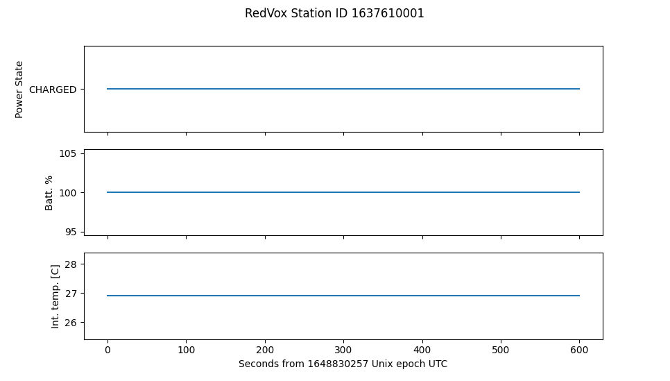

# Load Metadata and State of Health data 

Metadata and State of Health are key pieces of information to understand how a Station is faring. In this example 
we examine how to obtain the Health sensor from the DataWindow.

## Running the example
The first step is to load [RedVox data](getting_data_from_report.md) into a
[DataWindow](https://github.com/RedVoxInc/redvox-python-sdk/tree/master/docs/python_sdk/data_window#-redvox-python-sdk-datawindow-manual).

```python
from redvox.common.data_window import DataWindow

# Input Directory
input_dir = "path/to/redvox/data/dw_1648830257000498_2.pkl.lz4"

# Load data window from report
dw = DataWindow.deserialize(input_dir)
```
Let's take a look at the metadata for each Station. 

```python
from redvox.common.data_window import DataWindow

# Input Directory
input_dir = "path/to/redvox/data/dw_1648830257000498_2.pkl.lz4"

# Load data window from report
dw = DataWindow.deserialize(input_dir)

for station in dw.stations():
        # Print some metadata
        print(f"Station {station.id()} Metadata:\n"
              f"station description: {station.metadata().station_description}\n"
              f"is station private: {station.metadata().is_private}\n"
              f"station make: {station.metadata().make}\n"
              f"station model: {station.metadata().model}\n"
              f"station os: {station.metadata().os}\n"
              f"station os version: {station.metadata().os_version}\n"
              f"redvox app version:  {station.metadata().app_version}\n"
              f"redvox packet duration in seconds: {station.metadata().packet_duration_s}\n")
```
This is just a subset of the available metadata. For a complete list, visit the 
[Station Metadata Documentation](https://github.com/RedVoxInc/redvox-python-sdk/tree/master/docs/python_sdk/data_window/station#station-metadata).

Let's take a look at the State of Health sensor. In this example, we will extract the power state, battery charge % and
internal temperature. The complete list of available State of Health can be found in the 
[Health Sensor Documentation](https://github.com/RedVoxInc/redvox-python-sdk/tree/master/docs/python_sdk/data_window/station#health-sensor)
.

```python
from redvox.common.data_window import DataWindow
import matplotlib.pyplot as plt

# Input Directory
input_dir = "path/to/redvox/data/dw_1648830257000498_2.pkl.lz4"

# Load data window from report
dw = DataWindow.deserialize(input_dir)

for station in dw.stations():
        # Print some metadata
        print(f"Station {station.id()} Metadata:\n"
              f"station description: {station.metadata().station_description}\n"
              f"is station private: {station.metadata().is_private}\n"
              f"station make: {station.metadata().make}\n"
              f"station model: {station.metadata().model}\n"
              f"station os: {station.metadata().os}\n"
              f"station os version: {station.metadata().os_version}\n"
              f"redvox app version:  {station.metadata().app_version}\n"
              f"redvox packet duration in seconds: {station.metadata().packet_duration_s}\n")

        # Check that there is state of health data
        if station.has_health_sensor():

            # Get some state of health data - example of what is available
            power_state = station.health_sensor().get_power_state_data()
            battery_charge_percentage = station.health_sensor().get_battery_charge_remaining_data()
            internal_temp_c = station.health_sensor().get_internal_temp_c_data()

            # The channels share the same timestamps
            health_time_micros = station.health_sensor().data_timestamps() - station.health_sensor().first_data_timestamp()
            health_time_s = health_time_micros*1E-6

```
We can also plot the State of Health using the [Matplotlib](https://matplotlib.org/) library.

```python
from redvox.common.data_window import DataWindow
import matplotlib.pyplot as plt

# Input Directory
input_dir = "path/to/redvox/data/dw_1648830257000498_2.pkl.lz4"

# Load data window from report
dw = DataWindow.deserialize(input_dir)

for station in dw.stations():
        # Print some metadata
        print(f"Station {station.id()} Metadata:\n"
              f"station description: {station.metadata().station_description}\n"
              f"is station private: {station.metadata().is_private}\n"
              f"station make: {station.metadata().make}\n"
              f"station model: {station.metadata().model}\n"
              f"station os: {station.metadata().os}\n"
              f"station os version: {station.metadata().os_version}\n"
              f"redvox app version:  {station.metadata().app_version}\n"
              f"redvox packet duration in seconds: {station.metadata().packet_duration_s}\n")

        # Check that there is state of health data
        if station.has_health_sensor():

            # Get some state of health data - example of what is available
            power_state = station.health_sensor().get_power_state_data()
            battery_charge_percentage = station.health_sensor().get_battery_charge_remaining_data()
            internal_temp_c = station.health_sensor().get_internal_temp_c_data()

            # The channels share the same timestamps
            health_time_micros = station.health_sensor().data_timestamps() - station.health_sensor().first_data_timestamp()
            health_time_s = health_time_micros*1E-6

            # Plot the state of health data - one subplot per channel
            fig, ax = plt.subplots(nrows=3, ncols=1, sharex='col')

            ax[0].plot(health_time_s, power_state)
            ax[1].plot(health_time_s, battery_charge_percentage)
            ax[2].plot(health_time_s, internal_temp_c)

            # Set labels and subplot title
            ax[0].set_ylabel('Power State')
            ax[1].set_ylabel('Batt. %')
            ax[2].set_ylabel('Int. temp. [C]')
            ax[2].set_xlabel(f"Seconds from {int(dw.start_date()*1E-6)} Unix epoch UTC")
            plt.suptitle(f"RedVox Station ID {station.id()}")

plt.show()
```
## Example output
After running the above code snippet, the following graph should appear:



For a more complete example on how to load the other sensor data, visit
[Github](https://github.com/RedVoxInc/redvox-examples/blob/main/examples/ex_03_metadata_and_soh/load_metadata_soh.py).

In the next section, we will take a look at [plotting wiggles](04_plot_wiggles.md).


