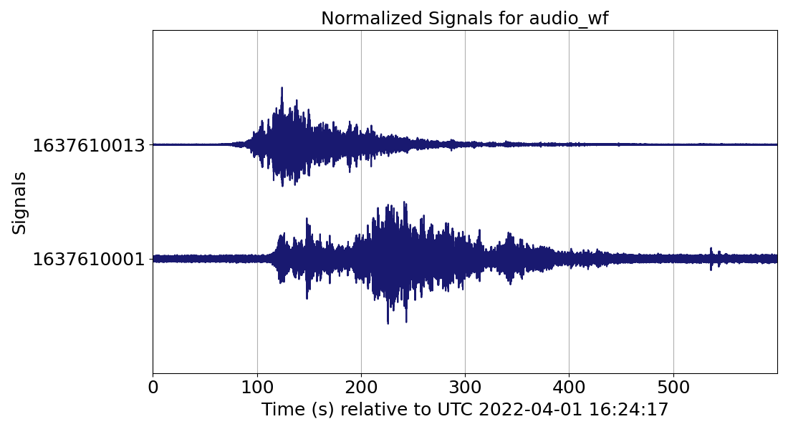

# Plot Audio waveforms

In this example we will examine how to plot Audio waveforms using [RedPandas](https://github.com/RedVoxInc/redpandas).

The first step is to load the
[DataWindow](https://github.com/RedVoxInc/redvox-python-sdk/tree/master/docs/python_sdk/data_window#-redvox-python-sdk-datawindow-manual).

```python
from redvox.common.data_window import DataWindow

# Input Directory
input_dir = "path/to/redvox/data/dw_1648830257000498_2.pkl.lz4"

# Load data window from report
dw = DataWindow.deserialize(input_dir)
```
The next step is to make a pandas dataframe using RedPandas [redpd_dataframe](https://github.com/RedVoxInc/redpandas/blob/master/docs/redpandas/using_redpandas.md#opening-redvox-data-with-redpandas).

```python
from redvox.common.data_window import DataWindow
from redpandas.redpd_df import redpd_dataframe

# Input Directory
input_dir = "path/to/redvox/data/dw_1648830257000498_2.pkl.lz4"

# Load data window from report
dw = DataWindow.deserialize(input_dir)

# Make a pandas DataFrame, where crucial information from DataWindow is extracted
# In this case, we are only extracting 'audio' from the DataWindow but other sensors such as 'barometer',
# 'accelerometer', 'gyroscope', 'magnetometer', 'health', or 'location' are possible
rp_df = redpd_dataframe(input_dw=dw,
                        sensor_labels=['audio'])

# See what columns are available
print(f'Available columns in RedPandas:\n{rp_df.columns.values}')
```

Let's plot the Audio waveforms using RedPandas [plot_wiggles_pandas](https://github.com/RedVoxInc/redpandas/blob/master/docs/redpandas/advance_use_redpandas.md#plot-waveforms)
and the [Matplotlib](https://matplotlib.org/) library.

```python
from redvox.common.data_window import DataWindow
from redpandas.redpd_df import redpd_dataframe
from redpandas.redpd_plot.wiggles import plot_wiggles_pandas
import matplotlib.pyplot as plt

# Input Directory
input_dir = "path/to/redvox/data/dw_1648830257000498_2.pkl.lz4"

# Load data window from report
dw = DataWindow.deserialize(input_dir)

# Make a pandas DataFrame, where crucial information from DataWindow is extracted
# In this case, we are only extracting 'audio' from the DataWindow but other sensors such as 'barometer',
# 'accelerometer', 'gyroscope', 'magnetometer', 'health', or 'location' are possible
rp_df = redpd_dataframe(input_dw=dw,
                        sensor_labels=['audio'])

# See what columns are available
print(f'Available columns in RedPandas:\n{rp_df.columns.values}')

# Plot wiggles
plot_wiggles_pandas(df=rp_df,  # the name of the redpandas dataframe, in this case rp_df
                    sig_wf_label='audio_wf',  # Column label with sensor data, in this case audio
                    sig_timestamps_label='audio_epoch_s',  # Column label with timestamps data
                    sig_id_label='station_id'  # name of column with the ID/names of stations.
                    # Important for setting the y_ticks
                    )

plt.show()
```

When you run the above snippet of code, you should see this graph with the waveforms:



You can also view this example in
[Github](https://github.com/RedVoxInc/redvox-examples/blob/main/examples/ex_04_plot_wiggles_audio/plot_redpandas_wiggles.py).

The next example, we will examine on how to plot [Audio spectrograms](05_plot_spectrogram.md).