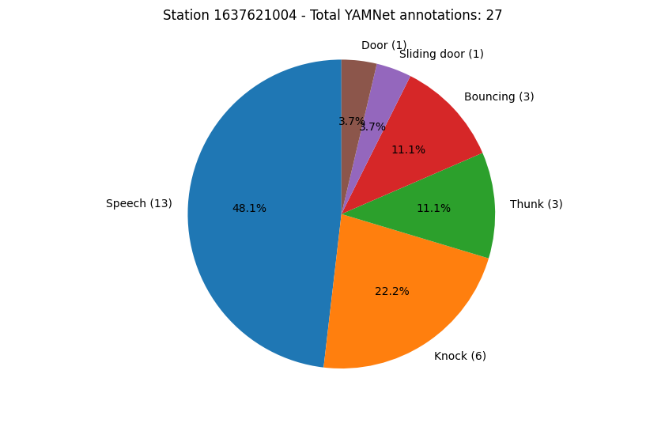

# Use the YAMNet CSV

At the end of the [previous example](06_get_yamnet_classifications.md), we downloaded a CSV file with basic information about the 
YAMNet classifications.  In this example, we will demonstrate how to use this file to display part of the data.

> **_NOTE:_**  To reproduce the results in this example, download the _YAMNet classification timeline (.csv)_ in 
> the _Additional Products_ section in [this report](https://redvox.io/#/reports/6598).

## Running the Example

First, we will read the CSV file and display the columns' titles.

```python
import pandas as pd

# Input path to CSV downloaded from report
input_file: str = "path/to/yamnet/data/YAMNet.csv"

# Load CSV
df = pd.read_csv(input_file)
print(f'Available columns: {df.columns.values}')
```

Now that we've confirmed we can read the CSV, we'll focus on the classification that YAMNet thinks is the most likely.
In the file, this classification is named `class_0`.  It is accompanied by the confidence score `score_0`.

```python
import pandas as pd
from typing import Dict

# Input path to CSV downloaded from report
input_file: str = "path/to/yamnet/data/YAMNet.csv"

# Load CSV
df = pd.read_csv(input_file)
print(f'Available columns: {df.columns.values}')

# Get ID of stations
stations = df["Station ID"].unique()

# for each of the stations, perform these tasks
for station in stations:
    # Get rows with station ID specific information
    df_station = df.loc[df['Station ID'] == station]
    # only look at the most likely classification
    dict_counts = df_station["class_0"].value_counts().to_dict()

    # Get index of max and min yamnet scores
    idx_max_score = df_station["score_0"].idxmax()
    idx_min_score = df_station["score_0"].idxmin()
    # Get names of most and least frequent class names
    most_frequent_class = df_station["class_0"].mode()[0]
    least_frequent_class = min(dict_counts, key=dict_counts.get)

    # Calculate average yamnet score per classification name
    dict_avg_scores: Dict = {}
    for idx, class_name in enumerate(dict_counts.keys()):

        df_class_name = df_station.loc[df_station['class_0'] == class_name]
        dict_avg_scores[f"{class_name}"] = "{0:.3f}".format(df_class_name['score_0'].mean())
```

Our statistics have been gathered, so we will now plot the results as a pie chart:

```python
import pandas as pd
import matplotlib.pyplot as plt
from typing import Dict

# Input path to CSV downloaded from report
input_file: str = "path/to/yamnet/data/YAMNet.csv"

# Load CSV
df = pd.read_csv(input_file)
print(f'Available columns: {df.columns.values}')

# Get ID of stations
stations = df["Station ID"].unique()

for station in stations:
    # Get rows with station ID specific information
    df_station = df.loc[df['Station ID'] == station]
    dict_counts = df_station["class_0"].value_counts().to_dict()

    # Some preparation to extract metrics
    # Get index of max and min yamnet scores
    idx_max_score = df_station["score_0"].idxmax()
    idx_min_score = df_station["score_0"].idxmin()
    # Get names of most and least frequent class names
    most_frequent_class = df_station["class_0"].mode()[0]
    least_frequent_class = min(dict_counts, key=dict_counts.get)

    # Calculate average yamnet score per classification name
    dict_avg_scores: Dict = {}
    for idx, class_name in enumerate(dict_counts.keys()):

        df_class_name = df_station.loc[df_station['class_0'] == class_name]
        dict_avg_scores[f"{class_name}"] = "{0:.3f}".format(df_class_name['score_0'].mean())

    # Start pie chart figure
    labels = [f"{key} ({str(dict_counts.get(key))})" for key in dict_counts.keys()]
    sizes = dict_counts.values()

    fig, ax = plt.subplots()
    plt.suptitle(f"Station {station} - Total YAMNet annotations: {sum(dict_counts.values())}")
    ax.pie(sizes, labels=labels, autopct='%1.1f%%', startangle=90)
    ax.axis('equal')  # Equal aspect ratio ensures that pie is drawn as a circle.

plt.show()
```

### Example Output


For a more complete example on how to load the CSV data, visit
[Github](https://github.com/RedVoxInc/redvox-examples/blob/main/examples/ex_07_yamnet_csv/yamnet_csv_metrics.py).
