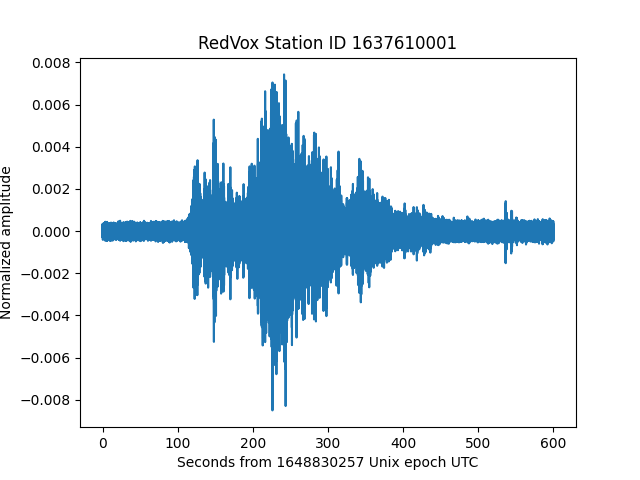

# Example 00: Audio waveforms from RedVox report DataWindow

Load audio waveform data from time aligned and corrected data window in a RedVox Report

For more information on getting started with the RedVox SDk, visit the 
[RedVox SDK Manual](https://github.com/RedVoxInc/redvox-python-sdk/tree/master/docs/python_sdk#-redvox-python-sdk-manual).

### Setup

You will need the RedVox SDK to run this example. The SDK can be installed running:
```shell
pip install redvox==3.1.13
```
For more instruction on installing the SDK, visit 
[RedVox SDK Installation](https://github.com/RedVoxInc/redvox-python-sdk/blob/master/docs/python_sdk/installation.md#-redvox-sdk-installation).

You will also need the Matplotlib library to plot the graphs. You can find installation instructions in 
[Matplotlib Installation](https://matplotlib.org/stable/users/installing/index.html). 

### Obtaining Data

Start from report page at:
https://redvox.io/#/reports/E328

In Additional Products, click in the Time aligned and corrected data window.

<p align="center">

</p>

A file named _dw_1648830257000498_2.pkl.lz4_ will start to download. 

### Running the Example

In load_audio.py, change input_dir (line 22) to point to your data directory where the DataWindow file 
_dw_1648830257000498_2.pkl.lz4_ is located.

### Example Output

<p align="center">

</p>


