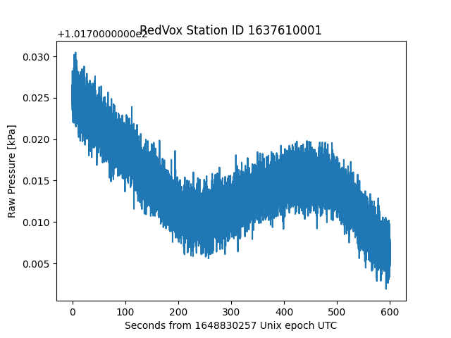

# Example 02: Other sensors in the RedVox report DataWindow

Load other sensors available in DataWindow such as barometer, gyroscope and magnetometer among others.
For more information on sensors available, visit the
[RedVox SDK Station Documentation](https://github.com/RedVoxInc/redvox-python-sdk/tree/master/docs/python_sdk/data_window/station#using-station).

Single channel sensors such as barometer load similar to audio (as seen in example ex_00_report_audio), multichannel 
sensors such as gyroscope or magnetometer load similar to the accelerometer sensors 
(as seen in example ex_01_report_accelerometer).

For more information on getting started with the RedVox SDK, visit the
[RedVox SDK Manual](https://github.com/RedVoxInc/redvox-python-sdk/tree/master/docs/python_sdk#-redvox-python-sdk-manual).

### Setup

You will need the RedVox SDK to run this example. The SDK can be installed by running:
```shell
pip install redvox==3.1.13
```
in a terminal with python enabled.

For more instructions on installing the SDK, please visit
[RedVox SDK Installation](https://github.com/RedVoxInc/redvox-python-sdk/blob/master/docs/python_sdk/installation.md#-redvox-sdk-installation).

You will also need the Matplotlib library to plot the graphs. You can find installation instructions in
[Matplotlib Installation](https://matplotlib.org/stable/users/installing/index.html).

### Obtaining Data

Start from report page at:
https://redvox.io/#/reports/E328

In Additional Products, click the `Time aligned and corrected data window` link.

<p align="center">

</p>

A file named `dw_1648830257000498_2.pkl.lz4` will start to download.

### Running the Example

In load_other_sensors.py, change input_dir (line 19) to the directory where the downloaded file
`dw_1648830257000498_2.pkl.lz4` is located.

### Example Output

<p align="center">

</p>

<p align="center">

</p>