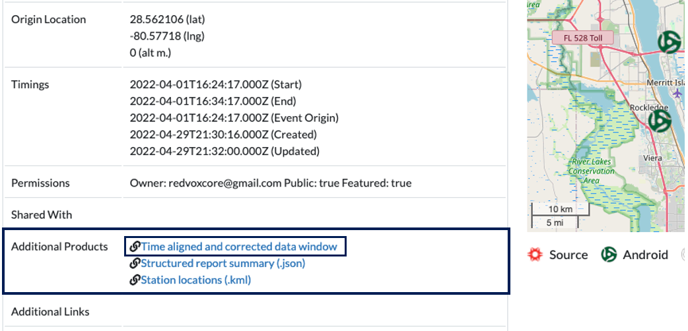
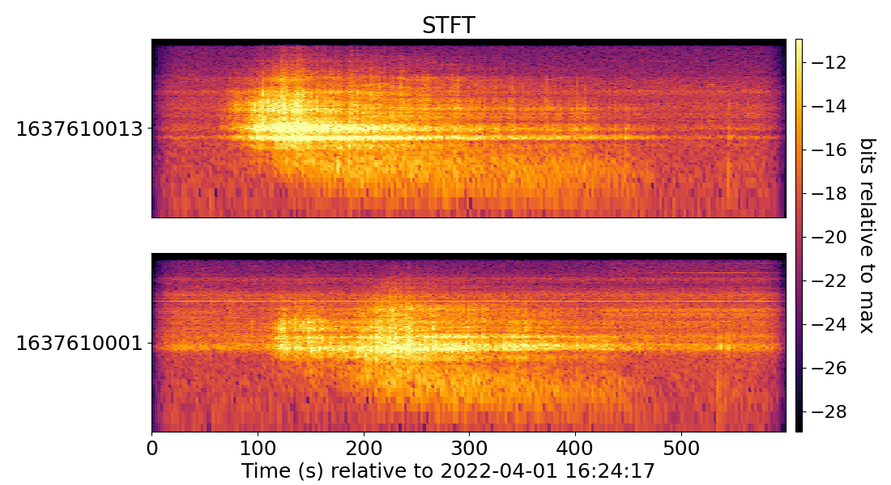

# Example 05: Plot audio spectrogram

Plot station spectrogram for audio from time aligned and corrected data window in a RedVox Report.

For more information on getting started with RedPandas, visit the
[RedPandas Documentation](https://github.com/RedVoxInc/redpandas/blob/master/docs/redpandas/using_redpandas.md#how-to-use-redpandas).

For more information on plotting other sensors and options, visit the
[RedPandas Advanced Documentation](https://github.com/RedVoxInc/redpandas/blob/master/docs/redpandas/advance_use_redpandas.md#how-to-use-redpandas---advanced-data-manipulation).


### Setup

You will need the RedVox SDK to run this example. The SDK can be installed by running:
```shell
pip install redvox==3.1.13
```
in a terminal with python enabled.

For more instructions on installing the SDK, please visit
[RedVox SDK Installation](https://github.com/RedVoxInc/redvox-python-sdk/blob/master/docs/python_sdk/installation.md#-redvox-sdk-installation).

You will also need the RedPandas library to process the data and plot the graphs. The library can be installed by running:
```shell
pip install redvox-pandas==1.3.5
```
in a terminal with python enabled.

You can find more installation instructions in
[RedPandas Installation](https://github.com/RedVoxInc/redpandas/blob/master/docs/redpandas/installation.md).

### Obtaining Data

Start from report page at:
https://redvox.io/#/reports/E328

In Additional Products, click the `Time aligned and corrected data window` link.

<p align="center">

</p>

A file named `dw_1648830257000498_2.pkl.lz4` will start to download.

### Running the Example

In plot_redpandas_spectrogram.py, change input_dir (line 25) to the directory where the downloaded file
`dw_1648830257000498_2.pkl.lz4` is located.

### Example Output

<p align="center">

</p>