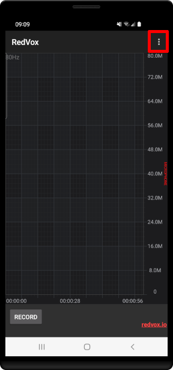
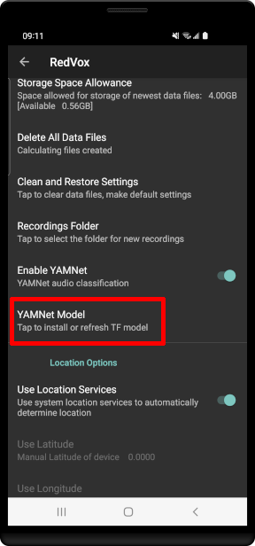
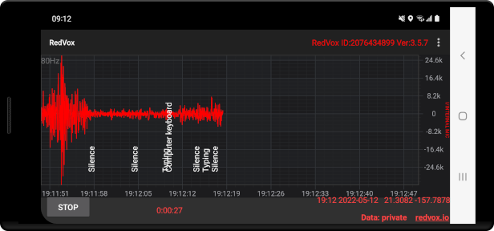
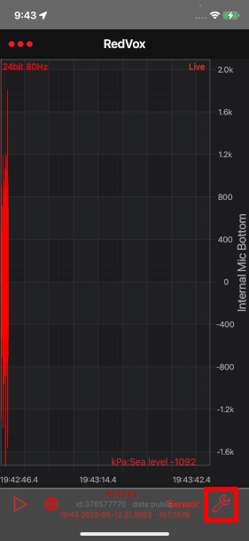
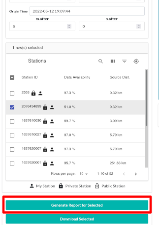
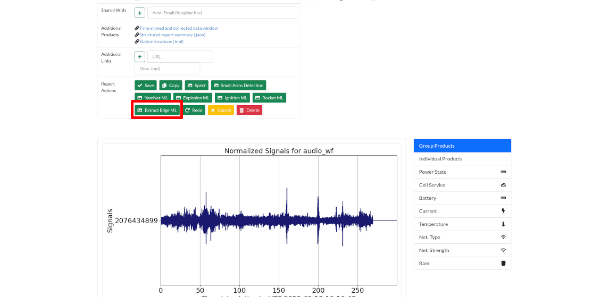
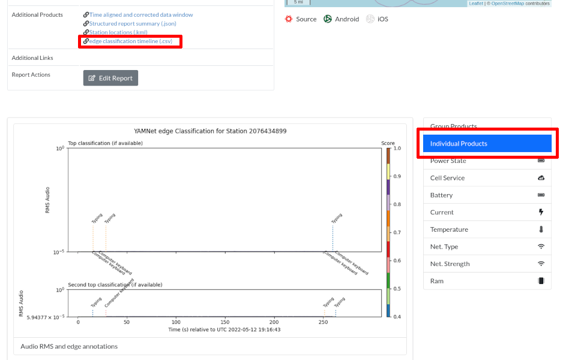
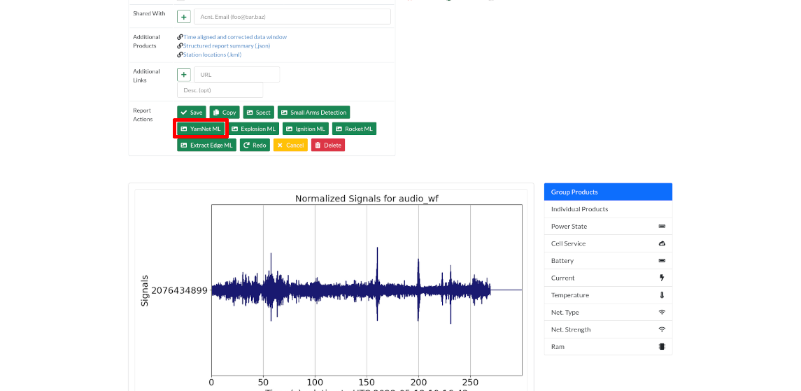

# Edge + cloud based YAMNet classification

The RedVox webpage (https://redvox.io) provides facilities for both extracting edge computed ML with TensorFlow Lite and performing cloud computed ML with full TensorFlow.

## RedVox Account

In order to use these features, you must be using a RedVox account that has the `RedVox` tier and the `YamNet` feature enabled. Accounts that meet these requirements include `redvoxcore` and `redvoxtesting4`.

Contact Anthony to include these features in another account.

## Enabling Edge YAMNet

Once the Android or iOS app is installed, setup, and logged in with an appropriate account, it's possible to enable YAMNet.

Edge based YAMNet can be enabled at any audio sampling rate.

### Android

Select the settings dropdown. 

Select the Settings button.

Scroll down to the YAMNet settings and click "Enable YAMNet".

It's also a good idea to ensure the app has the latest model by selecting "YAMNet Model".

To check that it's working, go back to the audio screen and start recording. Make some noises and you should see annotations appearing in the audio plot and specgtrogram.

### iOS

Select the settings icon.

Scroll down to the Machine Learning Settings and select "Enable YamNet".

To check that it's working, go back to the audio screen and start recording. Make some noises and you should see annotations appearing in the audio plot.

## YAMNet on the edge and in the cloud

It's possible to view edge based predictions using the RedVox cloud interface.

First, log into the redvox.io webpage with the username you recorded data with. Navigate to the Dashboard, select the station(s) you want to extract the edge ML from, select a time window, and click "Generate Report for Selected".

Once the report finishes building, navigate to it by clicking the report link.

### Extracting edge predictions

Once a report is made, the edge based predictions can be extracted.

Click "Edit Report".

Then select "Extract Edge ML".

Wait for the augmentation to complete with the following message.

Finally, refresh the page. This will produce two new products. A CSV file containing the entire prediction timeline for each station and a figure that shows the top two predictions for each station.

### Performing cloud predictions

Full tensorflow models can also be ran within the cloud environment. Since cloud ML is performed on the audio provided, it works best with 16 kHz audio, however, other sampling rates will be resampled to 16 kHz. Resampling may affect results.

To generate edge predictions, generate a report for the target stations and target time window as described in the previous section. 

Once a report is made, the cloud based predictions can be added.

Click "Edit Report".

Then select "YamNet ML".

Wait for the augmentation to complete with the following message. This will generally take longer than just extracting edge results. 

Finally, refresh the page. This will produce two new products. A CSV file containing the entire prediction timeline for each station and a figure that shows the top two predictions for each station.

