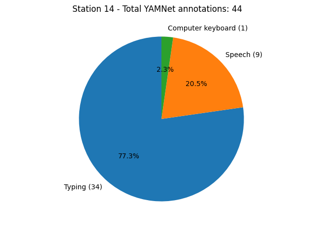

# Example 07: YAMNet CSV from RedVox Report

Showcase possible uses of the YAMNet CSV made in the RedVox Reports, such as extracting model metrics and statistics 
from the CSV.

### Setup

You will need to install the Pandas library 
([Pandas Installation](https://pandas.pydata.org/docs/getting_started/install.html))
and the Matplotlib library to plot the graphs 
([Matplotlib Installation](https://matplotlib.org/stable/users/installing/index.html)).

### Obtaining the YAMNet CSV

Please read about [Cloud YAMNet](https://github.com/RedVoxInc/redvox-examples/blob/main/examples/ex_06_cloud_yamnet/cloud_yamnet.md#yamnet-on-the-edge-and-in-the-cloud)
before proceeding for instructions on how to download the YAMNet CSV file.

Download `YAMNet classification timeline (.csv)` in the Additional Products section of a RedVox Report. 

### Running the Example

In yamnet_csv_metrics.py, change input_file (line 13) to the path of the downloaded CSV file.

### Example Output

