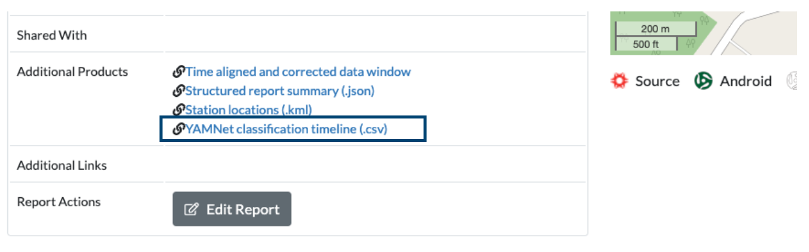

# Example 07: YAMNet CSV from RedVox Report

Showcase possible uses of the YAMNet CSV made in the RedVox Reports, such as extracting model metrics and statsitics 
from the CSV.

### Setup

You will need to install the Pandas library 
([Pandas Installation](https://pandas.pydata.org/docs/getting_started/install.html))
and the Matplotlib library to plot the graphs 
([Matplotlib Installation](https://matplotlib.org/stable/users/installing/index.html)).

### Obtaining the YAMNet CSV

Please read about [Cloud YAMNet](https://github.com/RedVoxInc/redvox-examples/blob/main/examples/ex_06_cloud_yamnet/cloud_yamnet.md#edge--cloud-based-yamnet-classification)
before proceeding as it explains how to activate and run the YAMNet examples that create the CSV.

Download `YAMNet classification timeline (.csv)` in the Additional Products section of a RedVox Report. 

### Running the Example

In yamnet_csv_metrics.py, change input_dir (line 19) to the directory where the downloaded file
`dw_1648830257000498_2.pkl.lz4` is located.

### Example Output